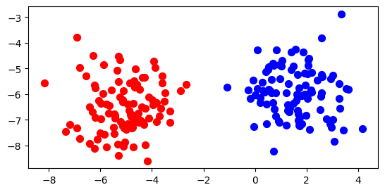
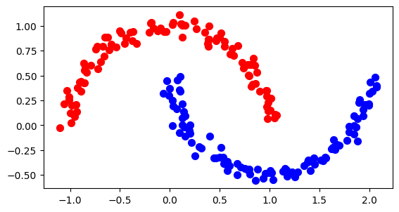

# knn_neural_network
## README

# **Project Purpose**

The purpose of this project is to explore the potential of using a neural network inspired by the K-Nearest Neighbors (KNN) algorithm and the KMeans clustering algorithm. We aim to investigate whether we can draw inspiration from these traditional methods and possibly improve them using different settings and configurations. By employing the `make_blobs` and `make_moons` datasets, we evaluate our approach initially on a fixed dataset and subsequently on a variable dataset.

### **Dataset Descriptions**

1. **Make Blobs**: This dataset creates two distinct clusters that the traditional KMeans algorithm can easily solve.
   
   
   
2. **Make Moons**: This dataset creates two interleaving half circles, which are more challenging for traditional clustering algorithms like KMeans.
   
   

### **KMeans Comparison**

In this project, we draw inspiration from the KMeans algorithm, specifically its initialization and clustering logic. The KMeans algorithm can be instantiated with various parameters as shown below:

```python
class sklearn.cluster.KMeans(n_clusters=2, *, init="random", n_init=1, max_iter=10, tol=0.0001, verbose=0, random_state=None, copy_x=True, algorithm='lloyd')
```

### **Initializations

1. Run Forward
   The "run forward" initialization involves running a forward pass through a randomly initialized neural network to generate initial labels. This approach leverages the network's initial random weights to create a preliminary clustering, which is refined through subsequent iterations.

2. Random
   In the "random" initialization, labels are assigned randomly to the dataset. This method provides a simple baseline for comparison against more sophisticated initialization techniques.

3. Two Points
   The "two points" initialization is inspired by the KMeans++ initialization method. Two random points are selected from the dataset, and the remaining points are assigned to the cluster of the closest selected point based on Euclidean distance. This approach helps in spreading out the initial cluster centers, potentially leading to better convergence.

### Samples
The samples are used based on the following assumptions:

**Idea 1 (Setting use_samples to True)
1. Two clusters are labeled (one of them as 1).
2. Sample points are generated based on the mean of the two clusters, adding more points around the mean.
3. The nearest neighbor logic is used to determine similarity from the ones labeled as 1, to get a labeling for the samples based on the average distance to the nearest k points.

**Idea 2 (Setting use_samples to False)
1. Two clusters are labeled (one of them as 1).
2. The other cluster is used with nearest neighbor logic to determine the similarity from the ones labeled as 1 to get the similarity.
3. The 2nd cluster is then labeled as 1, and the same process is repeated with the other sample.
   
### Mixup Logic
Mixup is a domain-agnostic data augmentation technique proposed by Zhang et al. in "mixup: Beyond Empirical Risk Minimization". It involves creating new training examples by combining existing ones through the following formulas:

```python

mixed*x = λ * x1 + (1 - λ) _ x2
mixed_y = λ _ y1 + (1 - λ) \_ y2
```
where λ is a mixing parameter sampled from a beta distribution. This technique can improve the robustness and generalization of the model. You can set use_mixup to True or False to enable or disable mixup augmentation.

### Jaccard Score
The Jaccard score is used to evaluate the similarity between the predicted labels and the true labels. It is defined as the size of the intersection divided by the size of the union of the label sets. We use the Jaccard score to determine which of the initializations, samples, and mixup configurations perform better.

### Code Execution
Installation
To execute the code, you will need to install the required dependencies. You can do this by using the requirements.txt file. Run the following command in your terminal:

```bash
pip install -r requirements.txt
```

Running the Experiments
The following experiments are conducted using different initialization methods, use of samples, mixup augmentation, and k ratios. To run the experiments, execute the following code:
```
python
# Experiment #1 -- fixed dataset, make blobs

initialization_methods = ['run forward', 'two points', 'random']
use_samples_options = [True, False]
use_mixup_options = [True, False]
k_ratios = [None]  
file_path = "./exp_results/blobs_fixed_dataset.csv"
results_df = experiment(initialization_methods, use_samples_options, use_mixup_options, k_ratios, file_path, dataset='blobs', variable=False)

# Experiment #2 -- variable dataset, make blobs

initialization_methods = ['run forward', 'two points', 'random']
use_samples_options = [True, False]
use_mixup_options = [True, False]
k_ratios = [None]  
file_path = "./exp_results/blobs_variable_dataset.csv"
results_df = experiment(initialization_methods, use_samples_options, use_mixup_options, k_ratios, file_path, dataset='blobs', variable=True)

# Experiment #3 -- fixed dataset, make moons

initialization_methods = ['run forward', 'two points', 'random']
use_samples_options = [True, False]
use_mixup_options = [True, False]
k_ratios = [0.1, 0.2, 0.3, 0.4, 0.5] # tested various k ratio configurations
file_path = './exp_results/moons_fixed_dataset_exp.csv'
results_df = experiment(initialization_methods, use_samples_options, use_mixup_options, k_ratios, file_path, dataset='moons', variable=False)

# Experiment #4 -- variable dataset, make moons

initialization_methods = ['run forward', 'two points', 'random']
use_samples_options = [True, False]
use_mixup_options = [True, False]
k_ratios = [0.1, 0.2, 0.3, 0.4, 0.5]  
file_path = './exp_results/moons_variable_dataset_exp.csv'
results_df = experiment(initialization_methods, use_samples_options, use_mixup_options, k_ratios, file_path, dataset='moons', variable=True)
Running these experiments will generate results and save them as CSV files in the specified paths. By analyzing the Jaccard scores from these experiments, we aim to determine which initialization methods, sample configurations, and mixup strategies yield the best performance in clustering.
```
### File Structure
This repository contains the following files and directories:

exp_results/: Directory containing the results of the experiments.

blobs_fixed_dataset.csv: Results of the fixed dataset using make_blobs.
blobs_variable_dataset.csv: Results of the variable dataset using make_blobs.
moons_fixed_dataset_exp.csv: Results of the fixed dataset using make_moons.
moons_variable_dataset_exp.csv: Results of the variable dataset using make_moons.
plots/: Directory intended for storing plots generated from the analysis.

knn_experiment.py: This script contains the main experiment code for running different initialization methods, sample configurations, and mixup strategies.

README.md: This file. It explains the purpose of the project, the experimental setup, and how to run the code.

requirements.txt: This file lists all the Python dependencies required to run the project. Install them using the command pip install -r requirements.txt.

test_significance.py: This script performs ANOVA and regression analysis on the experiment results to determine the significance and impact of different configurations.
